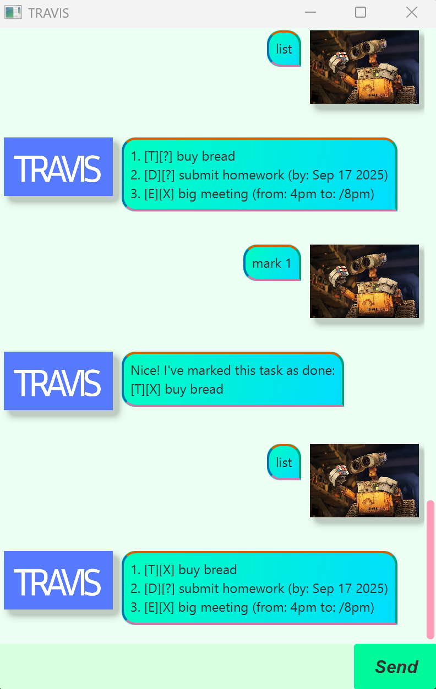

# TRAVIS User Guide



Welcome to the **TRAVIS** chatbot, where you can keep track of your to-dos,
your deadlines, as well as the major events in your life!

## Adding and deleting tasks

There are 3 categories of tasks that are supported by TRAVIS:
1. To-dos
2. Deadlines
3. Events

- To add a _to-do_, simply type the following command: `todo [task name]`.
- To add a _deadline_, type the following command: `deadline [task name] /by [deadline]`.
For TRAVIS to recognise your deadline, it should be formatted as `YYYY-MM-DD`!
- To add an _event_, type the following command: `event [task name] /from [start] /to [end]`.

**Do not add leading or trailing whitespaces to your commands.**

Upon each successful task added, TRAVIS will notify you that it has successfully added the task to the list.
It should display something like:
```
A new task has been added:
[T][?] buy bread
Now you have 5 task(s) in your list.
```

To delete a task, use the `delete [task number]` command. If successful, the task will be removed from the task list,
and TRAVIS will inform you of the number of tasks you have remaining.
If the task number is not within the acceptable range, TRAVIS will prompt you to input a suitable task number!

## Viewing existing tasks

To view the existing list of tasks in your list, simply type `list`.
TRAVIS will display your existing tasks like so:
```
1. [T][?] buy bread
2. [D][?] submit homework (by: Sep 17 2025)
3. [E][X] big meeting (from: 4pm to: 8pm)
```

Each task is prefixed by two tags: the first is the task type (`T` for to-dos, `D` for deadlines, `E` for events),
while the second is either `X` (completed) or `?` (not completed).

If there are no existing tasks, TRAVIS will say so and prompt you to add new tasks :)

The user may also find tasks that contain a specific search input using `find [search input]`.
This will display all tasks whose task name contains the search input.

## Mark and unmarking tasks

To mark a task as done or not done, type `mark [task number]` or `unmark [task number]`, respectively.
Similarly, if the task number is out of bounds, TRAVIS will prompt you with to input a suitable task number!

_Note: Marking or unmarking a task that is already done or undone has no impact._

### 📅 Start organising your life with TRAVIS, starting today! 📅